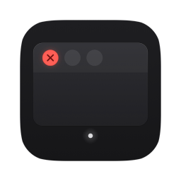
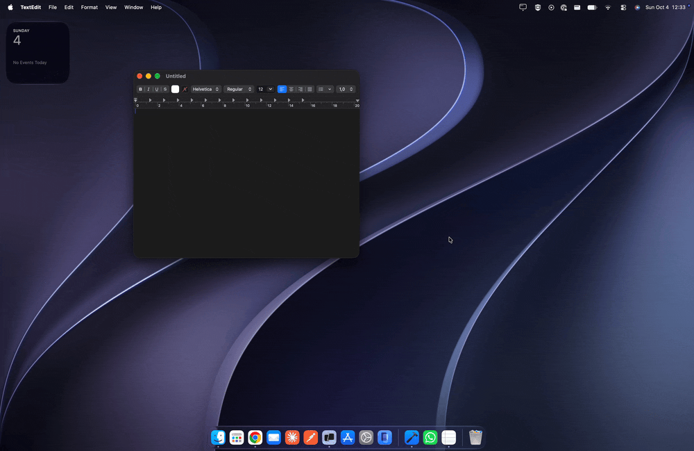
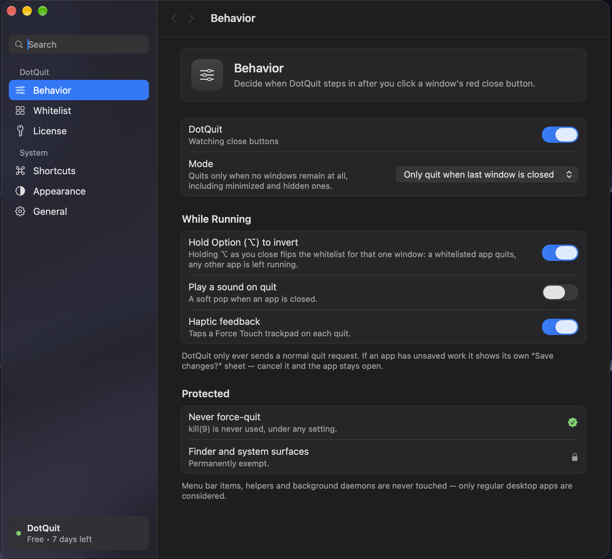

<div align="center">



# DotQuit

**Zero-bloat macOS menu bar utility that automatically quits apps when their last window is closed.**

Native Swift + AppKit, **~19 MB** resident, zero idle CPU — it keeps your RAM clean without becoming the thing that eats it.

<br>

[](https://github.com/mehmettalhairmak/dotquit/releases/latest/download/DotQuit.dmg)
[](https://buy.polar.sh/polar_cl_tfdIyrLDQxAYfrf82gdBeNrCVPXjyA5CqFSO90Eitzf)

[](https://www.apple.com/macos/)
[](#features)
[](#1-direct-download-dmg--recommended)
[](LICENSE)

</div>

<p align="center">
  
</p>

<div align="center">

### 🚀 Product Hunt Launch Special

Use code **`PRODUCTHUNT`** at checkout for **100% off DotQuit Pro** — free for the first 100 people.

[](https://buy.polar.sh/polar_cl_tfdIyrLDQxAYfrf82gdBeNrCVPXjyA5CqFSO90Eitzf)

</div>

---

## Why DotQuit?

On macOS the red **✕** doesn't quit anything — it closes a window. The app stays resident, holding its memory and keeping its Dock indicator lit, waiting for a `⌘Q` that never comes. Open Preview for one PDF, close it, and it's still there an hour later.

DotQuit watches for the one event that matters — a window being destroyed — and asks whether the app has anything left on screen. If not, it sends a normal quit request. Exactly what `⌘Q` does, nothing more violent.

```
window destroyed
      ↓
  wait 600ms              ← fullscreen transitions destroy and recreate windows
      ↓
is it a regular GUI app?  ← menu bar items and daemons are never touched
      ↓
is it whitelisted?        ← hold ⌥ to invert this for one close
      ↓
any windows left?         ← on-screen (CoreGraphics) + minimized (Accessibility)
      ↓
  app.terminate()         ← never kill(9), never force
```

Unsaved work still triggers the app's own **"Save changes?"** sheet. Cancel it and the app stays open.

---

## Features

- **Zero-idle architecture** — no polling, no timers. Driven entirely by `AXObserver` window notifications and `NSWorkspace` lifecycle events.
- **Smart Whitelist flyout** — hover the whitelist row and a panel slides out to the left: running apps on top, protected apps below, one click to move between them.
- **Option (⌥) to invert** — hold Option while closing to flip the decision for that one window.
- **Safe by construction** — `terminate()` only, never a force-kill. Finder, Dock and loginwindow are permanently exempt, and `.accessory` menu bar items are never even observed.
- **Native settings** — a real System Settings-style window with behavior, whitelist, license, shortcuts, appearance and general panes.
- **Privacy-friendly telemetry** — anonymous counters via [TelemetryDeck](https://telemetrydeck.com), one toggle to switch off entirely.

<p align="center">
  
</p>

<p align="center"><sub>The native settings window — behavior, whitelist, license, shortcuts, appearance and general panes.</sub></p>

### Key specs

| | |
|---|---|
| Language | Native Swift + SwiftUI, no Electron, no helpers |
| Memory | **~19 MB** resident |
| Idle CPU | **0.00 s** measured over 45 s |
| Binary | Universal — Apple Silicon `arm64` + Intel `x86_64` |
| Signing | Developer ID, hardened runtime, **Apple notarized** |
| Requires | macOS 14.0 Sonoma or later |

---

## Installation

### 1. Direct Download (DMG) — recommended

[](https://github.com/mehmettalhairmak/dotquit/releases/latest/download/DotQuit.dmg)

1. Open the DMG and drag **DotQuit.app** into **Applications**.
2. Launch it — DotQuit lives in the menu bar, with no Dock icon by default.
3. Grant Accessibility access when prompted.

The build is **code-signed with an Apple Developer ID, notarized by Apple, and stapled**. It opens on first launch like any other app — no right-click → Open, no `xattr -d`, no Privacy & Security override. Gatekeeper reports it as `source=Notarized Developer ID`.

### 2. Homebrew

Homebrew support is coming soon (pending official homebrew-cask submission).

### 3. Build from Source

For developers, and always free:

```bash
git clone https://github.com/mehmettalhairmak/dotquit.git
cd dotquit
open DotQuit.xcodeproj          # build and run, or:
./Scripts/build-release.sh      # universal build -> ./dist
```

Requires macOS 14.0+ and Xcode 16 or newer. Dependencies resolve through SwiftPM ([TelemetryDeck](https://github.com/TelemetryDeck/SwiftClient), pinned in `Package.resolved`).

> DotQuit cannot be sandboxed — cross-process `AXObserver`, `AXUIElementCopyAttributeValue` and `NSRunningApplication.terminate()` are all blocked inside a sandbox container. It ships as a hardened-runtime Developer ID app with a deliberately minimal entitlements file.

### Granting Accessibility access

**System Settings → Privacy & Security → Accessibility → enable DotQuit**

DotQuit cannot see window events without it. The Shortcuts & Permissions pane shows live status with a button that takes you straight there; until access is granted the menu bar icon stays dimmed and DotQuit does nothing.

### Using it

| Action | How |
|---|---|
| Open the popover | Click the dot in the menu bar |
| Whitelist an app | Hover **Smart Whitelist** → click `+` |
| Spare one app, once | Hold `⌥` while closing its window |
| Pause for an hour | **Pause for 1 Hour** in the popover |
| Toggle DotQuit | `⌥⇧Q` (configurable) |
| Open settings | `⌘,` |

---

## Support & Commercial Licensing

[](https://buy.polar.sh/polar_cl_tfdIyrLDQxAYfrf82gdBeNrCVPXjyA5CqFSO90Eitzf)

**$2.99 once. Two Macs. Every future update.** There's a 7-day trial, and activation lives under **Settings → License**.

> **🚀 Product Hunt launch special** — enter code **`PRODUCTHUNT`** at [checkout](https://buy.polar.sh/polar_cl_tfdIyrLDQxAYfrf82gdBeNrCVPXjyA5CqFSO90Eitzf) for **100% off DotQuit Pro**. Free for the first 100 people.

The source is GPLv3 and you can always build it yourself for free. A license funds the signed, notarized builds, support, and continued development — it isn't a key that unlocks the code. Activation is bound to the machine's hardware UUID, so reinstalling never burns a seat, and deactivating releases it.

---

## Privacy

DotQuit observes window *lifecycle events*. It cannot read window contents, text, keystrokes, clipboard or any app's private data.

Telemetry is anonymous, powered by TelemetryDeck, and switched off under **Settings → General → Share anonymous usage diagnostics** — off means the SDK is never initialized, not merely muted. Five counters are sent; well-known public bundle identifiers go in the clear so the numbers mean something, and **everything else becomes a salted SHA-256 digest**, so a private or enterprise app never appears by name. Window titles, file paths, keystrokes and your license key are never transmitted.

---

## License

DotQuit is free software under the **GNU General Public License v3.0** — full text in [`LICENSE`](LICENSE). You may use, study, modify and redistribute the source, and distribute builds you make from it, provided derivative works stay under GPLv3 and ship their corresponding source.

[TelemetryDeck SwiftClient](https://github.com/TelemetryDeck/SwiftClient) is MIT-licensed, which is GPLv3-compatible.

## Author

Built by **Mehmet Talha Irmak**.

If DotQuit saves you a few gigabytes and a lot of `⌘Q`, [a lifetime license is $2.99](https://buy.polar.sh/polar_cl_tfdIyrLDQxAYfrf82gdBeNrCVPXjyA5CqFSO90Eitzf).
